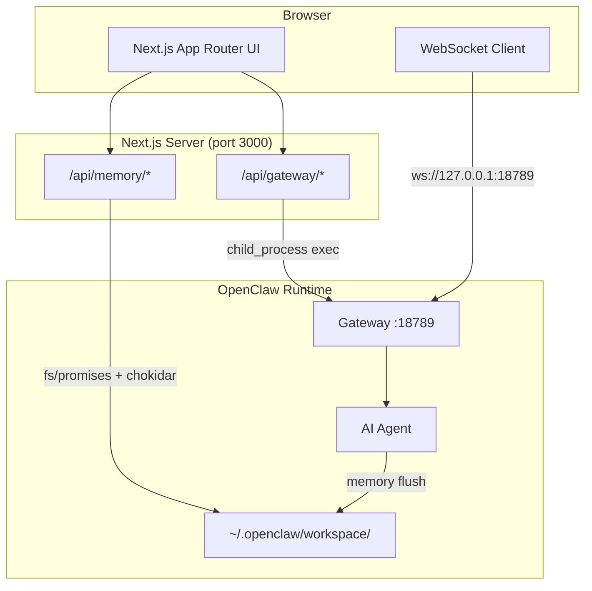

# OpenClaw Full-Stack Dashboard

A production-quality full-stack TypeScript dashboard for the [OpenClaw](https://github.com/openclaw/openclaw) AI agent framework. Built as a portfolio piece for the Spookling backend engineering role.

## Quick Start

```bash
# Prerequisites: Node.js 18+ and OpenClaw installed globally
npm install -g openclaw@latest

# Install and run
npm install
npm run dev
```

Open [http://localhost:3000](http://localhost:3000).

## Architecture



## Features

| Feature | Implementation |
|---------|---------------|
| **Real-time Chat** | WebSocket to OpenClaw Gateway on port 18789 |
| **Memory Studio** | Live file watcher on `~/.openclaw/workspace/`, markdown editor + preview |
| **Memory Search** | `openclaw memory search` CLI with local fallback |
| **Heartbeat Monitor** | 5s polling of Gateway status, flush detection |
| **Gateway Controls** | Start/stop/restart via `child_process.exec` |
| **Dark UI** | Tailwind CSS v4 + shadcn/ui components |

## Tech Stack

- **Next.js 15** App Router + TypeScript (strict)
- **Tailwind CSS v4** with custom dark theme
- **Radix UI** primitives (tabs, tooltips, scroll areas)
- **lucide-react** icons
- **chokidar** file watching (server-side)
- **marked** for markdown rendering
- **date-fns** for time formatting
- Zero external services — runs entirely local

## How This Demonstrates Spookling Backend Qualifications

| Job Requirement | Evidence in This Project |
|----------------|------------------------|
| **TypeScript backend expertise** | Strict-mode TS across API routes, type-safe WebSocket handling, proper error boundaries |
| **OpenClaw memory system** | Direct integration with `~/.openclaw/workspace/`, live file watching, read/write/search of memory files |
| **Persistent storage handling** | File system operations via `fs/promises`, path traversal protection, workspace directory management |
| **Heartbeat / health monitoring** | Real-time Gateway status polling, PID detection, memory flush detection |
| **Gateway control plane** | Start/stop/restart via CLI orchestration, port status checking |
| **Full-stack capability** | Next.js 15 App Router, WebSocket client, responsive dark-mode UI |
| **Tinkerer spirit** | Built as an unsolicited portfolio project — shipped a complete product to prove capability |
| **Production patterns** | Input validation, error handling, graceful degradation, loading states |
| **AWS-ready architecture** | Stateless API routes, filesystem abstraction (swappable to S3), WebSocket proxy pattern |

## Project Structure

```
app/
├── api/
│   ├── gateway/        # Start, stop, status routes
│   └── memory/         # Read, write, search routes
├── components/
│   ├── Dashboard.tsx       # Main layout + routing
│   ├── ChatPanel.tsx       # WebSocket chat interface
│   ├── MemoryStudio.tsx    # File browser + editor
│   ├── HeartbeatMonitor.tsx # Health monitoring
│   └── GatewayControls.tsx # Start/stop/restart buttons
├── layout.tsx
├── page.tsx
└── globals.css
```

## License

MIT

---

*Built in <4 hours as a tinkerer project for Spookling.*
