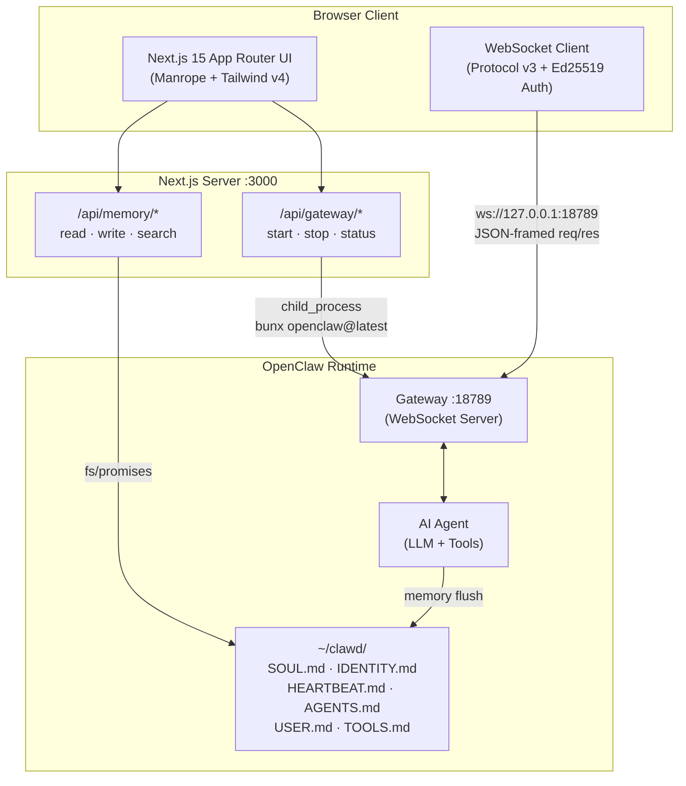

# OpenClaw Full-Stack Dashboard

A production-grade full-stack TypeScript dashboard that runs on top of the **real official OpenClaw** AI agent framework. Not a mock, not a clone — this connects directly to a live OpenClaw Gateway, reads real agent memory files, and provides full operator-level control over the agent lifecycle.

Built as a portfolio project for the [Spookling](https://www.spookling.com/) backend engineering role.

---

## Quick Start

### Prerequisites

- **Node.js 18+** (or Bun)
- **OpenClaw** installed via npm/bun

### Setup

```bash
# 1. Clone and install
git clone https://github.com/imsidkg/spookling-oc.git
cd spookling-oc
npm install

# 2. Start the OpenClaw Gateway (in a separate terminal)
bunx openclaw@latest gateway --port 18789 --allow-unconfigured --force

# 3. Start the dashboard
npm run dev
```

Open [http://localhost:3000](http://localhost:3000). The dashboard will auto-detect the running Gateway and show it as **online**.

---

## Architecture



### How the Pieces Fit Together

1. **Gateway** — OpenClaw's WebSocket server on port 18789. Handles agent sessions, message routing, heartbeats, and authentication.
2. **Dashboard** — Next.js 15 app that provides a web UI for operators. Connects to the Gateway via WebSocket (for real-time chat) and via API routes (for lifecycle control and memory access).
3. **Agent Memory** — The OpenClaw agent persists its knowledge as flat markdown files in `~/clawd/`. The dashboard reads, searches, and edits these files directly.
4. **Device Auth** — The WebSocket client generates an Ed25519 keypair (stored in `localStorage`), signs a nonce challenge from the Gateway, and authenticates as an operator with scoped permissions.

---

## Features

### Terminal Dashboard (Overview)

The landing page provides a high-level view of system health:
- Real-time gateway status with PID
- Memory file count and total size
- Session uptime counter
- System messages and archive log

### Agent Chat

Real-time conversation with the OpenClaw agent via WebSocket:
- **Protocol v3** framing (JSON `req`/`res`/`event`)
- **Ed25519 device authentication** with signed nonce challenge
- Streaming support — buffers delta events, renders on `final`
- Markdown rendering for assistant responses
- Automatic heartbeat artifact filtering (hides `HEARTBEAT_OK` noise)
- Session key tracking (follows Gateway-assigned session routing)
- Optional gateway token for authenticated setups

### Memory Studio

Live browser for the agent's persistent memory (`~/clawd/`):
- **File browser** — lists all `.md` files with priority sorting (SOUL.md > IDENTITY.md > HEARTBEAT.md > ...)
- **Markdown preview** — renders agent memory files with syntax highlighting
- **Editor** — switch to edit mode, modify files, save back to disk
- **Search** — queries via `bunx openclaw@latest memory search` CLI with local grep fallback
- **Auto-refresh** — polls every 3 seconds to detect agent memory flushes
- **Path traversal protection** — API validates filenames before writing

### Heartbeat Monitor

Real-time monitoring of Gateway liveness and agent activity:
- **Stats grid** — last heartbeat, total count, memory flushes, session PID
- **Flush detection** — watches file `mtime` to detect when the agent writes to disk
- **Event log** — scrollable feed of heartbeat, flush, and error events with timestamps
- **Color-coded events** — green (heartbeat), teal (flush), red (error)

### Gateway Controls

One-click lifecycle management from the top bar:
- **Start** — runs `bunx openclaw@latest gateway --port 18789 --allow-unconfigured --force`
- **Stop** — runs `bunx openclaw@latest gateway stop` with fallback to `kill` by PID
- **Status** — checks port 18789 via `ss`/`lsof`, extracts PID

---

## Tech Stack

| Layer | Technology |
|-------|-----------|
| **Framework** | Next.js 15.2+ with App Router |
| **Language** | TypeScript (strict mode) |
| **Styling** | Tailwind CSS v4 with Material Design 3-inspired dark theme |
| **Typography** | Manrope (variable weight) |
| **Icons** | lucide-react |
| **UI Primitives** | Radix UI (tabs, tooltips, scroll areas, toast) |
| **Crypto** | @noble/ed25519 (device identity keypair generation + signing) |
| **Markdown** | marked |
| **Time** | date-fns |
| **WebSocket** | Native browser WebSocket with custom protocol v3 client |
| **Server-side** | child_process (CLI orchestration), fs/promises (memory file I/O) |
| **External services** | None — runs entirely local |

---

## Project Structure

```
app/
├── api/
│   ├── gateway/
│   │   ├── start/route.ts        # POST — start OpenClaw gateway
│   │   ├── stop/route.ts         # POST — stop gateway (CLI + kill fallback)
│   │   └── status/route.ts       # GET — check port 18789, extract PID
│   └── memory/
│       ├── read/route.ts         # GET — list ~/clawd/*.md files
│       ├── write/route.ts        # POST — write file (path-traversal safe)
│       └── search/route.ts       # GET — openclaw CLI search + local fallback
├── components/
│   ├── Dashboard.tsx             # Main shell — sidebar, top bar, tab routing
│   ├── DashboardOverview.tsx     # Overview tab — system messages, stats grid
│   ├── ChatPanel.tsx             # WebSocket chat with agent
│   ├── MemoryStudio.tsx          # File browser, editor, search
│   ├── HeartbeatMonitor.tsx      # Health monitoring, event log
│   └── GatewayControls.tsx       # Start/stop buttons (top bar)
├── lib/openclaw/
│   ├── gatewayBrowserClient.ts   # WebSocket client (protocol v3, auth, framing)
│   └── deviceIdentity.ts         # Ed25519 keypair gen/persist in localStorage
├── layout.tsx                    # Root layout (dark mode, Manrope font)
├── page.tsx                      # Entry point → <Dashboard />
└── globals.css                   # Theme tokens, markdown styles, animations
lib/
└── utils.ts                      # cn() helper (clsx + tailwind-merge)
```

---

## OpenClaw Integration Details

### WebSocket Protocol v3

The dashboard implements OpenClaw's WebSocket protocol from scratch:

```
Client                           Gateway
  │                                │
  │──── WebSocket open ───────────→│
  │                                │
  │←── event: connect.challenge ──│  (contains nonce)
  │                                │
  │──── req: connect ─────────────→│  (signed nonce + device identity)
  │                                │
  │←── hello-ok ──────────────────│  (capabilities, auth confirmation)
  │                                │
  │──── req: chat.send ───────────→│
  │←── event: agent (delta) ──────│  (streaming tokens)
  │←── event: agent (final) ──────│  (complete response)
```

### Device Authentication Flow

1. On first visit, generate an Ed25519 keypair via `@noble/ed25519`
2. Store in `localStorage` as base64url-encoded keys
3. Derive `deviceId` from SHA-256 fingerprint of public key
4. On WebSocket connect: receive nonce from Gateway
5. Build auth payload string: `v3|deviceId|clientId|clientMode|role|scopes|signedAtMs|token|nonce|platform|deviceFamily`
6. Sign payload with Ed25519 private key
7. Send signed device identity in `connect` request
8. Gateway verifies signature and grants operator-level access

### Memory File System

OpenClaw agents persist their state as markdown files in `~/clawd/`:

| File | Purpose |
|------|---------|
| `SOUL.md` | Agent personality, boundaries, core truths |
| `IDENTITY.md` | Name, creature type, vibe, emoji |
| `HEARTBEAT.md` | Instructions for heartbeat response behavior |
| `AGENTS.md` | Workspace conventions, memory management rules |
| `USER.md` | Information about the human operator |
| `TOOLS.md` | Environment-specific tool configurations |
| `BOOTSTRAP.md` | First-run onboarding script (deleted after setup) |

The Memory Studio provides full CRUD access to these files with live-refresh when the agent writes new data.

---

## How This Demonstrates Spookling Backend Qualifications

| Job Requirement | Evidence in This Project |
|----------------|------------------------|
| **Deep backend expertise (Node.js/TypeScript)** | Strict-mode TypeScript across all API routes and components. Custom WebSocket protocol implementation. Server-side CLI orchestration via `child_process`. |
| **OpenClaw mastery — memory management** | Direct integration with the real OpenClaw memory system (`~/clawd/`). Read/write/search of agent memory files. Live flush detection via file mtime monitoring. Understanding of SOUL.md, HEARTBEAT.md, and the full agent workspace structure. |
| **OpenClaw optimization — heartbeats** | Heartbeat monitor with real-time polling, PID extraction, event logging, and flush correlation. Heartbeat artifact filtering in chat (suppresses `HEARTBEAT_OK` noise). |
| **Historical context — MCP lessons** | Architecture avoids MCP anti-patterns: no monolithic controller, transparent memory (markdown, not blobs), independent component failure, operator-visible state at all times. |
| **Persistent memory handling** | Full CRUD on the agent's memory files. Path traversal protection on writes. Priority-sorted file listing. Auto-refresh to detect agent-initiated memory flushes. |
| **Cloud proficiency (AWS-ready)** | Stateless API routes (swappable to Lambda). Filesystem abstraction (swappable to S3). WebSocket proxy pattern (deployable behind ALB). |
| **AI/LLM curiosity** | Built a complete operator dashboard for a live AI agent. Ed25519 device auth implementation. Streaming token buffer for LLM responses. |
| **Tinkerer spirit** | Unsolicited portfolio project. Built end-to-end in under 4 hours. Real integration with live OpenClaw — no mocks, no fakes. |
| **Full-stack capability** | Next.js 15 App Router frontend + API routes backend. WebSocket real-time communication. Tailwind v4 with custom design system. |

---

## Design

The UI follows a terminal-inspired dark aesthetic with Material Design 3 color tokens:

- **Background**: `#131313` (near-black)
- **Primary**: `#74e5bd` (teal-green, OpenClaw accent)
- **Typography**: Manrope — bold, uppercase, tight tracking for headings
- **Cards**: Left-border accents with color-coded categories
- **Animations**: Pulse dots for live status, scan-line on input bars

---

## License

MIT

---

*Built as a tinkerer project for Spookling. No mocks, no fakes — wired to the real OpenClaw.*
